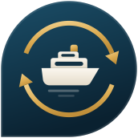
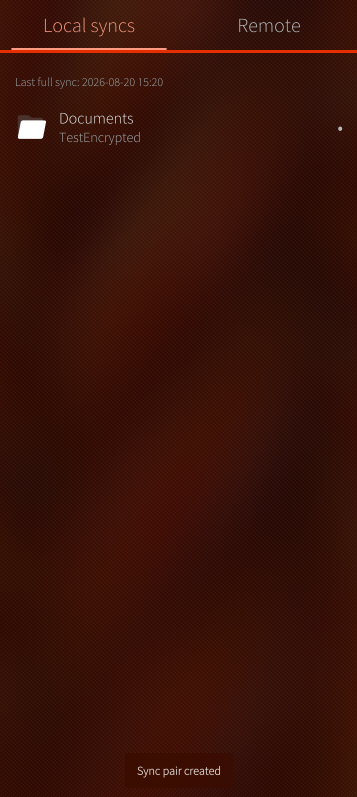
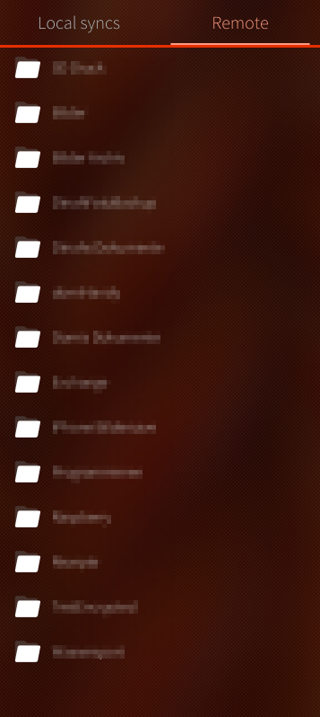
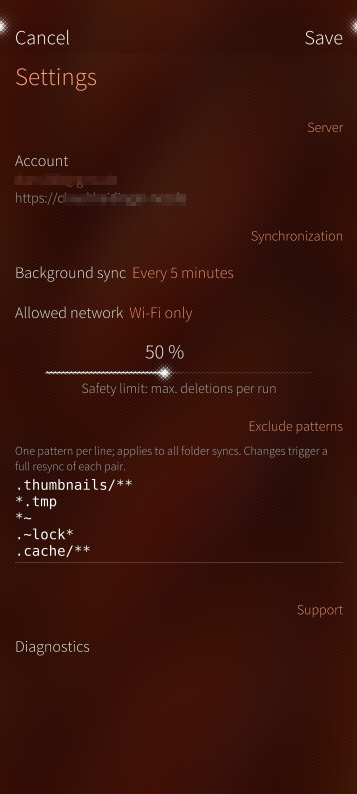

<!-- markdownlint-disable MD041 -->

    
    
 
    
     
    <b>Ferry Sync for Sailfish OS</b> 
    <b>(Cloud File Sync)</b>

## Introduction

Ferry Sync is a native file sync and cloud browser app for Sailfish OS: connect it to your cloud server, browse your files, and keep local folders synchronized in both directions.

[rclone](https://rclone.org) is the transfer and sync engine.

<!-- -->
<!--  -->

## Features

- **Two-way folder sync** (`rclone bisync`) per sync pair — whole folder or just a single file
- **Upload only (one-way)** (`rclone copy`) per sync pair — pushes a local folder to the remote and never deletes anything there; for camera or document backups
- **Currently implemented backends**: **Seafile**, **Nextcloud**, **SFTP** and **FTP/FTPS**
- **Remote browser**: navigate your libraries/folders, create folders, upload, download and delete
- **Open files directly on the device**: built-in text viewer, text editor and image viewer
- **file browser for uploads and sync pairs** — every folder below home, the SD card and the file system root; hidden files on demand, all file types, multi-select
- **Background sync via systemd user timer**: every 5 / 15 / 30 minutes, ... — or manual only
- **Network rule**: Wi-Fi only or Wi-Fi and mobile data; runs are skipped when offline
- **Safety limit against mass deletion**: a run that wants to delete unusually much is aborted and waits for your explicit confirmation ("Force sync")
- **Global exclude patterns**, editable line by line (`*.tmp`, `.thumbnails/**`, …)
- **Per-run sync logs** viewable in the app, plus a permanent **diagnostics page** for support cases
- **Cover action** "Sync now" with status at a glance
- **Translations via [Weblate](https://hosted.weblate.org/projects/harbour-ferry/)**: EN, DE, NO

  

### Backends: FTP/FTPS and SFTP

Both are set up with a single server field; the port is optional
(`host:2121`). FTP defaults to encrypted FTPS - put `ftp://` in front of the
address to fall back to plain, unencrypted FTP. What the protocols cost you:

- **FTP carries no reliable modification times**, and rclone cannot compare
  checksums over FTP either, so all a two-way pair can compare is the file
  size: a conflict keeps both versions instead of preferring the newer file,
  and a change that leaves the size untouched goes unnoticed. Upload-only
  pairs do not have that gap - they re-upload everything that changed
  locally since their last successful run, whatever the size says.
- **SFTP** logs in with username and password; key files are not supported
  yet. The server's SSH host key is verified: the key seen while
  setting the account up is stored and its fingerprint shown, so it can
  be compared with the server's own, and a server that later presents a
  different key is refused instead of being given the password.

## Supported Backends

For a full list of backends the engine can talk to, please refer to
[rclone.org/overview](https://rclone.org/overview/).

If you want to use a backend that is not yet implemented and it is on the list
above, please [create an issue](https://github.com/Dominik-h-hub/harbour-ferry/issues)
and I will add it.

Adding one new backend: every provider is a single Python module in
[qml/utilities/backends/](qml/utilities/backends/). The account form, the
wording of the remote browser ("libraries" vs. "folders") and the sync engine
are all generated from that definition.

## Technical Information

- Qt 5.6.3 (Sailfish OS Silica UI) + Python 3 backend via PyOtherSide — no C++,
  no Java
- **rclone** as the one and only transfer and sync engine, bundled in the RPM
  (aarch64, armv7hl, i486); currently v1.74.3, see
  [rclone-binaries/](rclone-binaries/README.md) for how to update it
- Background sync as a short-lived systemd user timer — no permanent daemon, no
  battery drain
- Credentials are stored through the Sailfish Secrets API; the rclone config
  itself is encrypted with rclone's own config encryption, so no plaintext
  credentials land on disk
- Sandboxing is disabled (`Sandboxing=Disabled`): inside the jail the Secrets
  daemon socket is invisible and `systemctl`/`python3` cannot be executed, which
  makes background sync and secure credential storage impossible
- Tested on:
  - Fairphone 4 - Sailfish OS 5.0.0.62
  - Emulator - Sailfish OS 5.0.0.62

## Contributing to the project

We are happy about any contribution to the project, whether it's bug fixes, new
features, translations or documentation.

## Localization

All language/regional translations are managed via [hosted.weblate.org](https://hosted.weblate.org/projects/harbour-ferry/)

If you want to contribute or create a new translations, please submit them via Weblate and don't submit them as pull requests.

Thanks for your consideration and contribution!

## License

This project is licensed under the Apache License 2.0 - see [LICENSE](LICENSE).

The packages additionally contain the rclone binary, which is licensed under
the MIT license. Its license notice ships with the package, see
[licenses/rclone-LICENSE.txt](licenses/rclone-LICENSE.txt).

## AI Information

AI (Claude) was used to:

- Generate comments in the code
- Generate technical documentation
- Code review and refactoring
- Debugging and testing support

## Trademark Disclaimer

Sailfish OS and the Sailfish OS logo are trademarks of Jolla Group Ltd.
Seafile is a trademark of Seafile Ltd. Nextcloud is a trademark of Nextcloud
GmbH. This project is not affiliated with, endorsed by or sponsored by any of
them.
